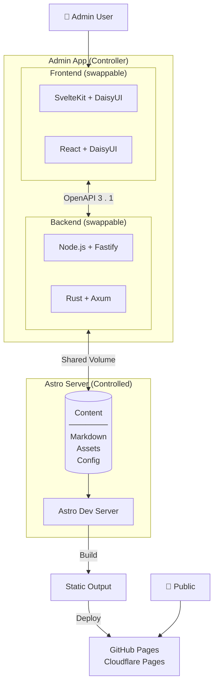
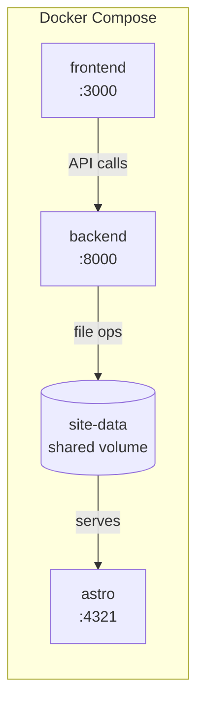

# Architecture

## System Overview

This is a blog engine prototype for experimenting with different frameworks. It provides an Admin App (controller) that
manages an Astro-based static site (controlled).


```mermaid
flowchart TB
    subgraph ADMIN["Admin App (Controller)"]
        direction TB

        subgraph FE["Frontend (swappable)"]
            SVELTE["SvelteKit + DaisyUI"]
            REACT["React + DaisyUI"]
        end

        subgraph BE["Backend (swappable)"]
            NODE["Node.js + Fastify"]
            RUST["Rust + Axum"]
        end

        FE <-->|OpenAPI 3 . 1| BE
    end

    subgraph ASTRO["Astro Server (Controlled)"]
        DEV["Astro Dev Server"]
        CONTENT[("Content\n───────\nMarkdown\nAssets\nConfig")]
    end

    BE <-->|Shared Volume| CONTENT
    CONTENT --> DEV
    DEV -->|Build| STATIC["Static Output"]
    STATIC -->|Deploy| PROD["GitHub Pages\nCloudflare Pages"]
    BROWSER["👤 Admin User"] --> FE
    VISITORS["👥 Public"] --> PROD
```

## Design Decisions

### Architecture

| Decision        | Choice                          | Rationale                                             |
|-----------------|---------------------------------|-------------------------------------------------------|
| Pattern         | Admin App controls Astro Server | Separation: UI for non-techy users, Astro for content |
| Communication   | Shared filesystem volume        | Simple, local-first, no network overhead              |
| Source of truth | Markdown files + Astro project  | Git-native, portable, no database lock-in             |

### API Contract

| Decision       | Choice                           | Rationale                                         |
|----------------|----------------------------------|---------------------------------------------------|
| Specification  | OpenAPI 3.1                      | Industry standard, JSON Schema 2020-12 compatible |
| Error format   | RFC 9457 Problem Details         | Standard, well-supported                          |
| Payload format | Simple envelope `{ data, meta }` | Room for metadata, simple serialization           |
| Relations      | Embedded                         | Simple CMS, no complex entity graphs              |

### Technology Stack

| Component         | Options                    | Notes                              |
|-------------------|----------------------------|------------------------------------|
| Frontend          | SvelteKit, React           | Both with DaisyUI, swappable       |
| Backend           | Node/Fastify/TS, Rust/Axum | Swappable, share same API contract |
| Static Site       | Astro                      | Templates, content collections     |
| Database          | None (filesystem)          | Config files if metadata needed    |
| Container Runtime | Docker + Compose           | Containerized services             |
| Base Image        | Alpine Linux               | Minimal resource usage             |

### Deployment

| Environment    | Setup                              |
|----------------|------------------------------------|
| Development    | Local Docker compose               |
| Production     | Linode (1GB + 2GB swap) or similar |
| Networking     | Tailscale for remote access        |
| Static Hosting | GitHub Pages / Cloudflare Pages    |

## Container Architecture


```mermaid
flowchart LR
    subgraph DOCKER["Docker Compose"]
        FE["frontend\n:3000"]
        BE["backend\n:8000"]
        ASTRO["astro\n:4321"]
        VOL[("site-data\nshared volume")]
    end

    FE -->|API calls| BE
    BE -->|file ops| VOL
    VOL -->|serves| ASTRO
```

### Compose File Strategy

```
compose.yaml                    # Base: network, volumes, astro
compose.frontend-svelte.yaml    # SvelteKit override
compose.frontend-react.yaml     # React override
compose.backend-node.yaml       # Node/Fastify override
compose.backend-rust.yaml       # Rust/Axum override
```

**Usage:**

```bash
# SvelteKit + Rust (sweet spot)
docker compose -f compose.yaml \
  -f compose.frontend-svelte.yaml \
  -f compose.backend-rust.yaml up

# React + Node
docker compose -f compose.yaml \
  -f compose.frontend-react.yaml \
  -f compose.backend-node.yaml up
```

## API Format

### Success Response

```json
{
  "data": {
    "id": "1",
    "title": "Hello World"
  },
  "meta": {
    "created": true
  }
}
```

### Collection Response

```json
{
  "data": [
    {
      "id": "1",
      "title": "Post One"
    },
    {
      "id": "2",
      "title": "Post Two"
    }
  ],
  "meta": {
    "total": 42,
    "page": 1,
    "perPage": 20
  }
}
```

### Error Response (RFC 9457)

```json
{
  "type": "https://api.example.com/errors/validation",
  "title": "Validation Error",
  "status": 400,
  "detail": "The 'title' field is required",
  "instance": "/api/posts",
  "errors": [
    {
      "field": "title",
      "message": "required"
    }
  ]
}
```

## Project Structure

```
/blog-engine-prototype
├── open-api-contracts/
│   └── api.yaml                 # OpenAPI 3.1 specification
│
├── admin-cms-app/
│   ├── frontend-svelte/         # SvelteKit + DaisyUI
│   ├── frontend-react/          # React + DaisyUI
│   ├── backend-node/            # Fastify + TypeScript
│   └── backend-rust/            # Axum
│
├── astro-server/                # Astro instance (controlled)
│
├── integration-tests/           # Playwright tests
│
├── compose.yaml                 # Base compose
├── compose.prod.yaml            # Frontend overrides
│
├── ARCHITECTURE.md              # This file
└── README.md                    # Project overview
```

## Developer Experience Architecture

The development workflow separates concerns: **Compose** runs services with hot reload, while **tests run on the host**
for fast TDD feedback.

```
HOST (Outside Compose)
======================

┌────────────────────────────────────────────────────────────┐
│         Integration Tests: mise run test-ui                │
│                      (Playwright)                          │
└────────────────────────────────────────────────────────────┘

┌──────────────┐ ┌──────────────┐ ┌──────────────┐ ┌──────────────┐
│ Rust         │ │ Node         │ │ Svelte       │ │ React        │
│ cargo watch  │ │ vitest       │ │ vitest       │ │ vitest       │
└──────────────┘ └──────────────┘ └──────────────┘ └──────────────┘
                      Unit Tests (watch mode)

                              │
                              │ HTTP
                              ▼

COMPOSE (dev watch mode)
========================

┌───────────────────────┐           ┌───────────────────────┐
│      Backends         │           │      Frontends        │
│                       │           │                       │
│  ┌─────────────────┐  │           │  ┌─────────────────┐  │
│  │ backend-rust    │  │  ┌─────┐  │  │ frontend-svelte │  │
│  │ :8080           │  │  │astro│  │  │ :3000           │  │
│  └─────────────────┘  │  │:4321│  │  └─────────────────┘  │
│  ┌─────────────────┐  │  └─────┘  │  ┌─────────────────┐  │
│  │ backend-node    │  │           │  │ frontend-react  │  │
│  │ :8081           │  │           │  │ :3001           │  │
│  └─────────────────┘  │           │  └─────────────────┘  │
└───────────────────────┘           └───────────────────────┘
```

### Port Scheme

| Service            | Port | Notes                |
|--------------------|------|----------------------|
| Rust backend       | 8080 | Sweet spot backend   |
| Node backend       | 8081 | Alternative backend  |
| SvelteKit frontend | 3000 | Sweet spot frontend  |
| React frontend     | 3001 | Alternative frontend |
| Astro server       | 4321 | Static site preview  |

### TDD Workflow (Multiple Terminals)

```
Terminal 1: mise run up              # Services with hot reload
Terminal 2: mise run test-ui         # Playwright watch (integration)
Terminal 3: mise run test-unit-rust  # Rust unit tests watch
Terminal 4: mise run test-unit-node  # Node unit tests watch
```

---

## Backend Resource Comparison

Comparing production Docker images after implementing minimal `/healthz` endpoints.

### Measurement Commands

```bash
docker image ls
docker stats --no-stream
```

### Results

| Container         | Image Size | Memory Usage |
|-------------------|------------|--------------|
| backend-rust-prod | 122 MB     | 0.75 MB      |
| backend-node-prod | 255 MB     | 26.5 MB      |

### Analysis

- **Image size**: Rust is ~2x smaller (122 MB vs 255 MB)
- **Memory usage**: Rust uses ~35x less RAM (0.75 MB vs 26.5 MB)
- **Note**: Node image includes Alpine + Node.js runtime + V8 engine; Rust compiles to a single static binary on Debian
  slim

## Coding style

- Test-driven development, with 100% coverage.
- Break everything down into small steps and implement test-first.
- For unit tests, use the language and framework's own unit testing solution.
- We implement integration tests using Playwright.
- Declarative and functional programming style is preferred.

- No `get_` prefix: `fn name(&self)` not `fn get_name(&self)`
- Mutable getter: `fn name_mut(&mut self)`

## Code-First API Approach

- Write the API in Rust Axum first.
- Use `utoipa-axum` to generate Swagger Open API yaml specification.
- Use `utoipa-swagger-ui` to publish the API doc.
- Export the generated specification to `open-api-contracts/api.yaml` to keep the frontend types in sync.
- Use `orval` in frontend projects to generate the compatible `react-query` and `svelte-query`.

## Quadlet Production Deployment

**Summary:** Migrate from `docker compose` (dev-oriented) to Quadlet (production-native, Podman-specific) for deployment:

- Quadlet = systemd generator that converts `.container` files → systemd services
- Native boot startup, auto-restart, journald logging, auto-updates
- Images pushed to ghcr.io, pulled on production server
- Files stored in `quadlet/` folder (tracked in git, symlinked to `~/.config/containers/systemd/`)

**Key benefits over compose:**

| Feature             | Compose          | Quadlet                          |
|---------------------|------------------|----------------------------------|
| Boot startup        | Extra config     | Native `WantedBy=default.target` |
| Auto-updates        | Needs watchtower | Built-in `AutoUpdate=registry`   |
| Process supervision | Limited          | Full systemd                     |
| Logs                | `docker logs`    | `journalctl`                     |

**Files to create when implementing:**

- `scripts/build-push-images.sh` — Build & push to ghcr.io
- `quadlet/*.container` — One per service (5 total)
- `quadlet/blog.network` — Shared network
- `quadlet/astro-sites.volume` — Shared volume
- `quadlet/README.md` — Deployment instructions
- mise tasks for `build-push`, `quadlet-up`, `quadlet-down`, etc.
