# Architecture

## System Overview

This is a blog engine prototype for experimenting with different frameworks. It provides an Admin App (controller) that
manages an Astro-based static site (controlled).

```mermaid
flowchart TB
    subgraph ADMIN["Admin App (Controller)"]
        direction TB

        subgraph FE["Frontend (swappable)"]
            SVELTE["SvelteKit + DaisyUI"]
            REACT["React + DaisyUI"]
        end

        subgraph BE["Backend (swappable)"]
            NODE["Node.js + Fastify"]
            RUST["Rust + Axum"]
        end

        FE <-->|OpenAPI 3.1| BE
    end

    subgraph ASTRO["Astro Server (Controlled)"]
        DEV["Astro Dev Server"]
        CONTENT[("Content\n───────\nMarkdown\nAssets\nConfig")]
    end

    BE <-->|Shared Volume| CONTENT
    CONTENT --> DEV

    DEV -->|Build| STATIC["Static Output"]
    STATIC -->|Deploy| PROD["GitHub Pages\nCloudflare Pages"]

    BROWSER["👤 Admin User"] --> FE
    VISITORS["👥 Public"] --> PROD
```



## Design Decisions

### Architecture

| Decision        | Choice                          | Rationale                                             |
|-----------------|---------------------------------|-------------------------------------------------------|
| Pattern         | Admin App controls Astro Server | Separation: UI for non-techy users, Astro for content |
| Communication   | Shared filesystem volume        | Simple, local-first, no network overhead              |
| Source of truth | Markdown files + Astro project  | Git-native, portable, no database lock-in             |

### API Contract

| Decision       | Choice                           | Rationale                                         |
|----------------|----------------------------------|---------------------------------------------------|
| Specification  | OpenAPI 3.1                      | Industry standard, JSON Schema 2020-12 compatible |
| Error format   | RFC 7807 Problem Details         | Standard, well-supported                          |
| Payload format | Simple envelope `{ data, meta }` | Room for metadata, simple serialization           |
| Relations      | Embedded                         | Simple CMS, no complex entity graphs              |

### Technology Stack

| Component         | Options                    | Notes                              |
|-------------------|----------------------------|------------------------------------|
| Frontend          | SvelteKit, React           | Both with DaisyUI, swappable       |
| Backend           | Node/Fastify/TS, Rust/Axum | Swappable, share same API contract |
| Static Site       | Astro                      | Templates, content collections     |
| Database          | None (filesystem)          | Config files if metadata needed    |
| Container Runtime | Podman + Compose           | Rootless, daemonless               |
| Base Image        | Alpine Linux               | Minimal resource usage             |

### Deployment

| Environment    | Setup                              |
|----------------|------------------------------------|
| Development    | Local Podman compose               |
| Production     | Linode (1GB + 2GB swap) or similar |
| Networking     | Tailscale for remote access        |
| Static Hosting | GitHub Pages / Cloudflare Pages    |

## Container Architecture


### Compose File Strategy

```
compose.yaml                    # Base: network, volumes, astro
compose.frontend-svelte.yaml    # SvelteKit override
compose.frontend-react.yaml     # React override
compose.backend-node.yaml       # Node/Fastify override
compose.backend-rust.yaml       # Rust/Axum override
```

**Usage:**

```bash
# SvelteKit + Rust (sweet spot)
podman-compose -f compose.yaml \
  -f compose.frontend-svelte.yaml \
  -f compose.backend-rust.yaml up

# React + Node
podman-compose -f compose.yaml \
  -f compose.frontend-react.yaml \
  -f compose.backend-node.yaml up
```

## API Format

### Success Response

```json
{
  "data": {
    "id": "1",
    "title": "Hello World"
  },
  "meta": {
    "created": true
  }
}
```

### Collection Response

```json
{
  "data": [
    {
      "id": "1",
      "title": "Post One"
    },
    {
      "id": "2",
      "title": "Post Two"
    }
  ],
  "meta": {
    "total": 42,
    "page": 1,
    "perPage": 20
  }
}
```

### Error Response (RFC 7807)

```json
{
  "type": "https://api.example.com/errors/validation",
  "title": "Validation Error",
  "status": 400,
  "detail": "The 'title' field is required",
  "instance": "/api/posts",
  "errors": [
    {
      "field": "title",
      "message": "required"
    }
  ]
}
```

## Project Structure

```
/blog-engine-prototype
├── open-api-contracts/
│   └── api.yaml                 # OpenAPI 3.1 specification
│
├── admin-app/
│   ├── frontend-svelte/         # SvelteKit + DaisyUI
│   ├── frontend-react/          # React + DaisyUI
│   ├── backend-node/            # Fastify + TypeScript
│   └── backend-rust/            # Axum
│
├── astro-server/                # Astro instance (controlled)
│
├── integration-tests/           # Playwright tests
│
├── compose.yaml                 # Base compose
├── compose.frontend-*.yaml      # Frontend overrides
├── compose.backend-*.yaml       # Backend overrides
│
├── ARCHITECTURE.md              # This file
├── CLAUDE.md                    # Project plan & progress
└── README.md                    # Project overview
```
