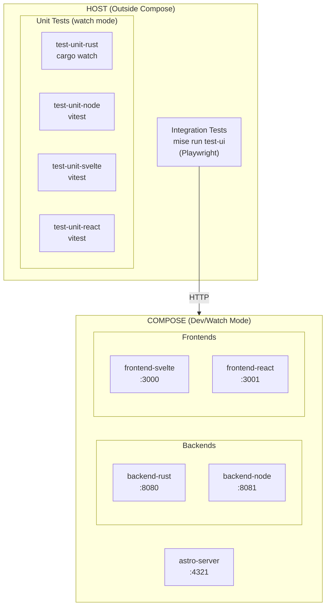

# Implementation Notes and Findings

## Developer Experience Architecture

The development workflow separates concerns: **Compose** runs services with hot reload, while **tests run on the host** for fast TDD feedback.



### Port Scheme

| Service | Port | Notes |
|---------|------|-------|
| Rust backend | 8080 | Sweet spot backend |
| Node backend | 8081 | Alternative backend |
| SvelteKit frontend | 3000 | Sweet spot frontend |
| React frontend | 3001 | Alternative frontend |
| Astro server | 4321 | Static site preview |

### TDD Workflow (Multiple Terminals)

```
Terminal 1: mise run up              # Services with hot reload
Terminal 2: mise run test-ui         # Playwright watch (integration)
Terminal 3: mise run test-unit-rust  # Rust unit tests watch
Terminal 4: mise run test-unit-node  # Node unit tests watch
```

---

## Backend Resource Comparison

Comparing production Docker images after implementing minimal `/healthz` endpoints.

### Measurement Commands

```bash
podman image ls
podman stats --no-stream
```

### Results

| Container         | Image Size | Memory Usage |
|-------------------|------------|--------------|
| backend-rust-prod | 122 MB     | 0.75 MB      |
| backend-node-prod | 255 MB     | 26.5 MB      |

### Analysis

- **Image size**: Rust is ~2x smaller (122 MB vs 255 MB)
- **Memory usage**: Rust uses ~35x less RAM (0.75 MB vs 26.5 MB)
- **Note**: Node image includes Alpine + Node.js runtime + V8 engine; Rust compiles to a single static binary on Debian slim

